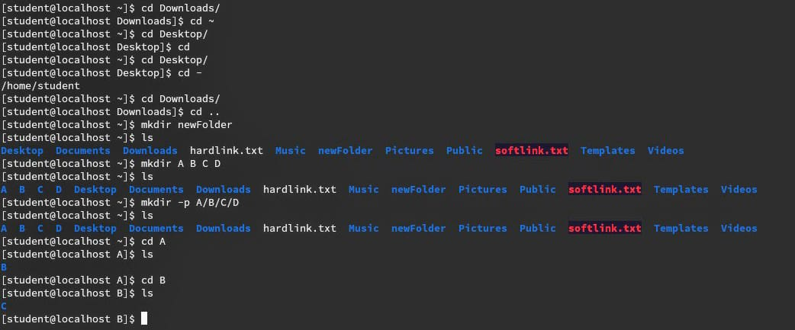

# Day 2: Basic Linux Commands Practice

## Commands Practiced

### 1. `ls` Command:
- **Usage**: List files and directories.
- **Example**: `ls -l` to list with details.
  
### 2. `pwd` Command:
- **Usage**: Print the current working directory.
- **Example**: `pwd` shows `/home/student`.

### 3. `cd` Command:
- **Usage**: Change directories.
- **Example**: `cd Downloads/` to go to the Downloads folder.
  
### 4. `mkdir` Command:
- **Usage**: Create directories.
- **Examples**:
  - `mkdir newFolder`: Creates a folder named `newFolder`.
  - `mkdir -p A/B/C/D`: Creates nested directories.

## Screenshots:
Below are the screenshots of my practice:

1. Directory Listing and Navigation:
   

2. Directory Creation:
   

3. Nested Directories:
   
