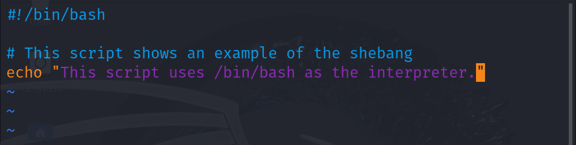

# 🚀 Day 4 Answers: Basic Linux Shell Scripting for DevOps Engineers

## 📝 Task 1: What Does Shell Scripting Mean for DevOps?

Shell scripting is all about writing a series of commands to automate tasks in Linux/Unix systems. For DevOps, it’s super helpful to:
- 🛠️ Automate repetitive tasks
- ⚙️ Manage system configurations
- 🚀 Deploy applications
- 🧰 Integrate tools/processes in CI/CD pipelines

This means you save time, reduce errors, and make processes efficient!

### Example: Automating Server Setup
```bash
#!/bin/bash
apt update && apt upgrade -y
apt install nginx -y
systemctl enable nginx
systemctl start nginx
Example: Automating server setup

## 🐚 Task 2: What is `#!/bin/bash`? Can We Use `#!/bin/sh`?

The line `#!/bin/bash` is known as a **shebang**. It tells the system which interpreter to use to run the script. This line is essential for ensuring your script executes in the correct environment.

### Details:
- **`#!/bin/bash`**: 
  - This specifies that the script should be run using the **Bash** shell.
  - Bash is a powerful shell that supports advanced features such as:
    - 📚 **Arrays**: Allows you to store and manipulate collections of data.
    - 🔑 **Associative Arrays**: Enables key-value pair storage for more complex data management.
    - 🔄 **Functions**: Lets you define reusable code blocks for better organization and modularity.

- **`#!/bin/sh`**: 
  - This indicates that the script should be executed with the **Bourne shell**.
  - The Bourne shell is more **POSIX-compliant**, making it compatible with various Unix-like operating systems.
  - While it lacks some of the advanced features of Bash, it provides a simpler environment suitable for basic scripting tasks.

### Example Usage:
```bash
#!/bin/bash
echo "This script is using the Bash shell!"



## ✍️ Task 3: Shell Script to Print a Message

In this task, we will create a simple shell script that prints a motivational message for the #90DaysOfDevOps challenge.

### Script

```bash
#!/bin/bash
echo "I will complete #90DaysOfDevOps challenge!"


## 🖥️ Task 4: Shell Script for User Input and Arguments

In this task, we will create a shell script that takes user input and input from command-line arguments, then prints these variables.

### Script

```bash
#!/bin/bash

# Taking user input
echo "Enter your name:"
read userName

# Taking input from arguments
arg1=$1
arg2=$2

# Printing the variables
echo "Hello, $userName! You have passed the following arguments:"
echo "Argument 1: $arg1"
echo "Argument 2: $arg2"


## 🔄 Task 5: If-Else Statement in Shell Scripting

In this task, we will create a shell script that compares two numbers using an **If-Else** statement. This is a fundamental concept in programming that allows you to execute different actions based on certain conditions.

### Script

```bash
#!/bin/bash

# Taking input for two numbers
echo "Enter the first number:"
read num1

echo "Enter the second number:"
read num2

# Comparing the two numbers using If-Else
if [ $num1 -gt $num2 ]; then
    echo "$num1 is greater than $num2"
elif [ $num1 -lt $num2 ]; then
    echo "$num1 is less than $num2"
else
    echo "$num1 is equal to $num2"
fi


Check out my blog for more details: [My Blog](https://chintamani1804.hashnode.dev/day-4-basic-linux-shell-scripting-for-devops-engineers)


